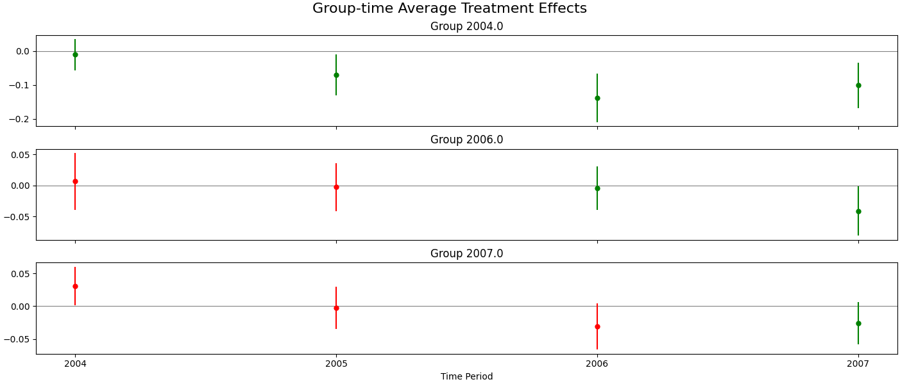

# CausaliPy

Causal Methods implemented in Python.

## Installation

Install via

```
pip install causalipy
```

It might make sense to add the py-arrow dependency (which is currently required
for the example):

```
pip install pyarrow
```

## Example

To run a version of the multi-period difference-in-difference estimator as
proposed by Callaway and Sant’Anna (2020)  (this requires additionally pyarrow  - e.g. via
`pip install pyarrow` - to be installed currently):

```python
from causalipy.did.multi_periods import MultiPeriodDid
import pandas as pd

url = "https://github.com/mohelm/causalipy-datasets/raw/main/mpdta-sample.feather"
data = pd.read_feather(url)

mpd_minimum_wage = MultiPeriodDid(
    data,
    outcome="lemp",
    treatment_indicator="treat",
    time_period_indicator="year",
    group_indiciator="first.treat",
    formula="~ 1",
)
mpd_minimum_wage.plot_treatment_effects()
```

This will give:



## License

This project is licensed under the terms of the MIT license.

